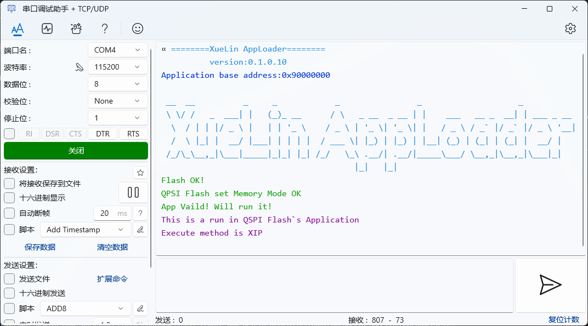

# 运行于反客STM32H750XBH6核心板的QSPI Flash代码加载器

## 原理
将QSPI Flash进行内存映射后设置应用程序的向量表和栈指针地址，然后获取应用程序的复位处理函数地址后跳转。其关键代码如下:

    // 定义跳转函数
    typedef void (*pFunction)(void);
    pFunction Jump_To_App;

    // 设置应用程序的向量表地址
    SCB->VTOR = QSPI_APP_ADDRESS;

    // 初始化应用程序的栈指针
    set_MSP(*(__IO uint32_t*)QSPI_APP_ADDRESS);

    // 获取应用程序的复位处理函数地址
    Jump_To_App = (pFunction)(*(__IO uint32_t*)(QSPI_APP_ADDRESS + 4));

## 代码执行截图:
